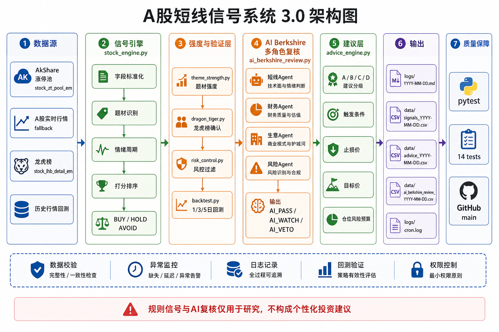

# A股短线规则信号系统

一个可在 Mac / Codex 环境中运行的 A股短线规则信号系统。系统使用 AkShare 获取行情与龙虎榜数据，按情绪周期、题材、资金强度、龙虎榜净买额和历史信号回测生成 `BUY / HOLD / AVOID` 规则信号。

> 重要声明：本项目仅用于研究、复盘和流程自动化，不构成投资建议，不提供自动交易能力。

## 架构图



## 功能

- A股行情抓取：通过数据源注册表依次尝试涨停池、全市场实时行情、Sina 行情和本地快照。
- 数据质量校验：记录空数据、零价格、缺失代码、成交额/涨跌幅不可用等 warning。
- 情绪周期：按接近涨停数量划分 `冰点 / 启动 / 主升 / 高潮`。
- 题材过滤：基于关键词识别 AI、半导体、机器人、华为链、低空经济等题材。
- 资金强度：成交额、涨跌幅、换手率、量比、封板资金、连板等规则评分。
- 龙虎榜验证：匹配东方财富龙虎榜，识别净买额、净卖额、上榜原因和确认强度。
- 资金流验证：匹配个股主力净流入，生成 `强确认 / 弱确认 / 未匹配 / 强分歧`。
- 回测验证：对已保存的历史信号文件做 1/3/5 个交易日收益验证。
- 统计验证：样本足够时输出 bootstrap 均值置信区间；样本不足时明确标记。
- Run Card：每次运行生成可审计运行卡，记录参数、warning、artifact hash。
- 假设注册表：将每日运行挂到固定研究假设，保留策略版本和 run card 链接。
- 收盘推荐复盘：收盘推荐 3-5 支候选必须落盘，次日自动复盘 1 日表现和推荐证据。
- 风控过滤：识别 ST/退市、北交所、流动性不足、过热涨幅、过高换手、龙虎榜分歧、单一题材集中。
- 题材强度：按题材股票数、平均涨幅、接近涨停数、成交额生成强度分。
- AI Berkshire 复核：用短线、财务、生意、风险四角色复核，输出 `AI_PASS / AI_WATCH / AI_VETO`。
- 投资建议层：生成 `A / B / C / D` 建议等级、触发条件、止损价、目标价和仓位风险预算。
- Codex Cron：支持 09:00、11:30、15:00 三段自动运行。

## 快速开始

```bash
git clone <your-repo-url>
cd a_stock_berkshire

python3 -m venv venv
source venv/bin/activate
pip install -r requirements.txt

./scripts/run.sh
```

运行后查看：

```bash
sed -n '1,120p' logs/$(date '+%Y-%m-%d').md
tail -n 80 logs/cron.log
```

## 输出文件

```text
logs/YYYY-MM-DD.md          # 中文报告
logs/YYYY-MM-DD.log         # JSON 摘要日志
logs/cron.log               # 运行日志
data/signals_YYYY-MM-DD.csv # 信号明细
data/advice_YYYY-MM-DD.csv  # 建议层明细
data/ai_berkshire_review_YYYY-MM-DD.csv # AI Berkshire 复核明细
data/backtest_YYYY-MM-DD.csv# 回测明细
data/backtest_groups_YYYY-MM-DD.csv # 分组回测
data/backtest_validation_YYYY-MM-DD.json # 统计验证
data/runs/YYYY-MM-DD/run_card.json # 可审计运行卡
data/runs/YYYY-MM-DD/run_card.md   # 可读运行卡
data/hypotheses.json       # 研究假设注册表
data/recommendations_YYYY-MM-DD.csv # 收盘候选推荐
data/recommendation_review_YYYY-MM-DD.csv # 次日推荐复盘
data/ai_berkshire_candidates_YYYY-MM-DD.csv # AI Berkshire 二次风控候选
```

## 项目结构

```text
.
├── stock_engine.py          # 主引擎：行情、评分、龙虎榜、回测摘要、报告输出
├── data_sources.py          # 数据源注册表与数据质量校验
├── dragon_tiger.py          # 龙虎榜抓取与匹配
├── fund_flow.py             # 主力资金流抓取与匹配
├── backtest.py              # 历史信号收益回测
├── validation.py            # 回测样本统计验证
├── run_card.py              # 运行卡与 artifact hash
├── hypothesis_registry.py   # 假设注册表与策略版本追踪
├── recommendations.py       # 收盘推荐落盘与次日复盘
├── risk_control.py          # 风控过滤与降级
├── theme_strength.py        # 题材强度评分
├── ai_berkshire_gate.py     # AI Berkshire 候选导出
├── ai_berkshire_review.py   # AI Berkshire 多角色复核
├── advice_engine.py         # A/B/C/D 建议层与价格计划
├── scripts/run.sh           # 标准运行入口
├── tests/                   # 基础逻辑测试
├── docs/                    # 发布文档
├── RUNBOOK.md               # 固定调用流程
├── SKILL.md                 # Codex skill 入口说明
└── requirements.txt         # Python 依赖
```

## 文档

- [架构说明](docs/ARCHITECTURE.md)
- [安装说明](docs/INSTALLATION.md)
- [使用说明](docs/USAGE.md)
- [运维说明](docs/OPERATIONS.md)
- [GitHub 发布清单](docs/PUBLISHING.md)
- [贡献指南](CONTRIBUTING.md)
- [免责声明](DISCLAIMER.md)
- [固定调用流程](RUNBOOK.md)

## 当前边界

当前没有：

- 券商下单
- 自动交易
- 游资席位标签识别
- 远端真实多 Agent 调度
- 财务数据双源自动校验
- 对当天信号声称未来收益胜率

当前 AI Berkshire 复核是本地规则化多角色复核，不等同于完整深度投研。`AI_PASS` 也不是买入建议，只表示复核层未发现否决性问题；最终仍需人工判断。

## 免责声明

本项目输出的 `BUY / HOLD / AVOID` 和 `A / B / C / D` 是研究与复盘标签，不是买卖建议。任何投资决策应由使用者独立判断并自行承担风险。详见 [DISCLAIMER.md](DISCLAIMER.md)。
